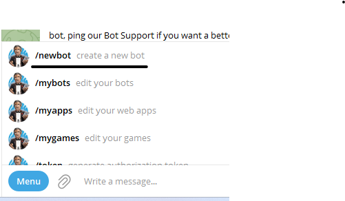
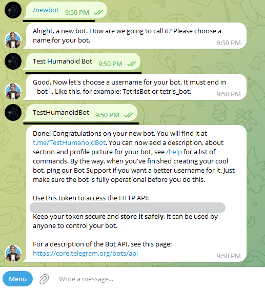
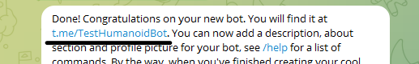
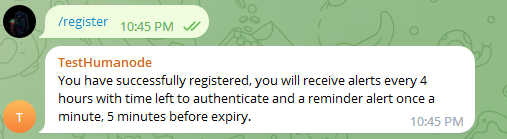

## Create a new bot

--------------------------------------------------------------------------------
### Go to telegram and find @BotFather (https://t.me/BotFather)
### From menu select `/newbot`

### Type name and bot username,and you will get a new bot with token
### `In the screen I have hidden the token (don't publish it anywhere, it's a secret token linked to your account)`

--------------------------------------------------------------------------------
## Configuration

--------------------------------------------------------------------------------
### Install openjdk-17-jdk: `sudo apt-get install openjdk-17-jdk`

--------------------------------------------------------------------------------
### Create directory: `mkdir /srv/humanode/`
### Go to directory: `cd /srv/humanode/`
### Clone jar from git: `git clone --branch build https://github.com/gicu-adasanu/humanode-alert.git`
### Go to directory: `cd humanode-alert`
### Edit application.properties and put your Telegram bot token: `bot.token=your_bot_token`

--------------------------------------------------------------------------------
## Run application in screen
### Create new screen: `screen -S humanode-alert`
### Run application: `java -Dspring.config.location=/srv/humanode/humanode-alert/application.properties -jar humanode-alert-1.0.0.jar`
### Exit from screen: `CTRL+A+D`

--------------------------------------------------------------------------------
## Register to receive alerts

### To receive alerts from this bot you must submit the command `/register`. Access the bot from the message you received from BotFather.

### You will receive a confirmation message

--------------------------------------------------------------------------------
## HELP
### Resume screen: `screen -r humanode-alert`

--------------------------------------------------------------------------------
## IMPORTANT 
### The application must be started on the same machine as the humanode.
### If you have this warn in console: `Chat id not found, need to register, to register type /register in chat with bot`, you are not registered.